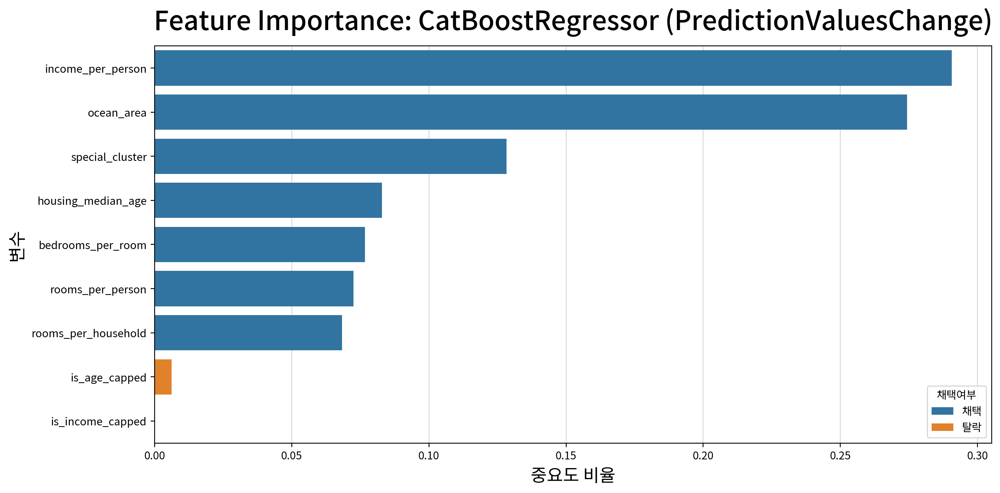
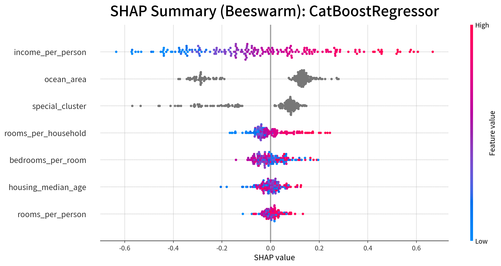
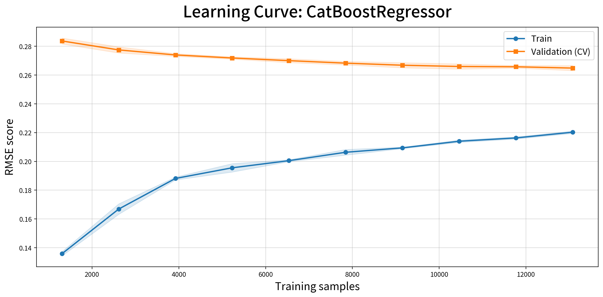

# California Housing 주택가격 예측

> 지역별 주택가격과 관련된 소득·입지·주거 구조를 탐색하고, 11개 회귀모형 비교부터 최종 CatBoost의 설명까지 연결한 분석입니다.

## 핵심 결과

| 항목 | 최종 실행 결과 |
|---|---:|
| 평가 R² | 약 0.785 |
| 평가 RMSE | 0.2659 |
| 5-Fold CV RMSE | 0.2651 ± 0.0016 |
| 훈련 RMSE | 0.2236 |
| 최종 입력 변수 | 7개 |
| SHAP 설명 표본 | 200행 |

**RMSE는 로그 변환된 주택가격 척도이며 달러 단위 오차가 아닙니다.** 훈련–CV RMSE 격차는 15.66%로, 진단 함수의 15% 경험적 기준에서 과대적합 경고가 남았습니다. 성능과 일반화 한계를 함께 보고합니다.

## 문제와 데이터

지역 규모가 크면 방·침실·인구·가구 수가 함께 커집니다. 단순 총량만으로 가격을 설명하기보다, **소득과 입지, 인구·가구 대비 주거 공간을 구분하면 어떤 예측 정보를 얻을 수 있는가?**를 확인했습니다.

| 구분 | 내용 |
|---|---|
| 데이터 | 1990년 미국 인구조사 기반 California Housing |
| 분석 단위 | 캘리포니아 인구조사 구역 — 개별 주택이 아님 |
| 규모 | 원본 20,640행 → 결측치 처리 후 20,433행 |
| 종속변수 | `median_house_value` — 지역 주택 중위가격 |
| 분할 | 훈련 16,346행 / 평가 4,087행, `random_state=3217` |
| 기술 | Python, pandas, 통계검정, scikit-learn, XGBoost, LightGBM, CatBoost, SHAP |

데이터는 `jussam.load_data()`로 불러옵니다. 01번은 `california_housing`, 02·03번은 품질 점검 데이터와 요약표, 04·05번은 `california_housing_feature_log_labelled`를 사용합니다. **현재 코드는 단계별 데이터 스냅샷을 로더에서 읽으며, 03번에서 저장한 엑셀을 04번이 자동으로 읽는 구조는 아닙니다.**

## 분석 과정

| 단계 | 수행 내용 | 노트북 |
|---|---|---|
| 01 | 데이터 구조·타입·중복·결측치, 기술통계 | [프로젝트 개요와 데이터 품질](notebooks/01_프로젝트_개요와_데이터_품질.ipynb) |
| 02 | 단변량·이변량·다변량 분석, 변수 선택 근거 | [탐색적 데이터 분석](notebooks/02_탐색적_데이터_분석.ipynb) |
| 03 | 비율형·범주형·공간 파생변수, 검증, 로그 변환·라벨링 | [분석용 데이터 전처리](notebooks/03_분석용_데이터_전처리.ipynb) |
| 04 | 11개 회귀모형 비교, 5-Fold GridSearchCV | [회귀모델링과 튜닝](notebooks/04_회귀모델링과_하이퍼파라미터_튜닝.ipynb) |
| 05 | 과적합 진단, 중요도 기반 변수 축소, 재학습, SHAP | [최종모델 평가와 SHAP](notebooks/05_최종모델_평가와_SHAP.ipynb) |

노트북에는 실제 실행 출력과 그래프를 함께 저장했습니다. 이 페이지는 결과와 판단을 먼저 보여주고, 세부 코드와 검정 결과는 각 노트북에서 확인할 수 있도록 구성했습니다.

## 모델 비교와 변수 축소

- 튜닝 전에는 SVR이 평가 RMSE 약 0.266으로 1위였습니다.
- 튜닝 후 비교에서는 CatBoost가 평가 RMSE 약 0.266, R² 약 0.785로 1위였습니다.
- VIF 처리 후 모델의 9개 변수 중 중요도 누적 95% 기준으로 7개를 채택했습니다. 실제 채택 누적 중요도는 99.37%입니다.
- 선택변수 재학습·튜닝 후 평가 RMSE는 0.2659였습니다. 변수 축소가 큰 성능 향상을 만들었다고 해석하지 않습니다.



최종 입력 변수는 `income_per_person`, `ocean_area`, `special_cluster`, `housing_median_age`, `bedrooms_per_room`, `rooms_per_person`, `rooms_per_household`입니다.

## 결과 해석



| 변수 | mean\|SHAP\| | 해석 범위 |
|---|---:|---|
| `income_per_person` | 0.2283 | 소득과 가구당 인구로 만든 구매력 대리변수. 실제 개인소득 측정값은 아님 |
| `ocean_area` | 0.1820 | 해안권·내륙 구분에 따른 모델 예측 기여 차이 |
| `special_cluster` | 0.1292 | 위·경도 기반 군집에 따른 지역적 예측 차이 |
| `rooms_per_household` | 0.0547 | 가구당 주거 공간과 관련된 예측 기여 |
| `bedrooms_per_room` | 0.0460 | 방 구성 비율과 관련된 예측 기여 |

소득 대리변수와 입지 변수가 예측 설명에서 상위권을 차지했습니다. Beeswarm에서는 소득 대리변수가 높은 관측치가 대체로 양의 기여를 보입니다. 주거 구조 변수는 추가적인 예측 차이를 설명합니다. 이 중요도는 **가격의 인과적 결정 비율이나 정책 개입 효과가 아닙니다.**

평균 절대 SHAP을 지수화하여 “가격이 평균적으로 ±몇 % 변한다”고 해석하지 않습니다. Dependence Plot의 색상 패턴 역시 상호작용을 탐색하는 단서이지 인과관계의 증명은 아닙니다.

## 일반화 진단과 한계



- **과적합 신호:** 훈련 오차보다 CV 오차가 높습니다. 15%는 도우미 함수의 경험적 경계값이지 통계적 판정 기준은 아닙니다.
- **평가 범위:** 무작위 분할과 여러 모델의 평가셋 비교 결과입니다. 독립적인 최종 홀드아웃이나 공간적으로 분리된 미관측 지역의 성능을 보장하지 않습니다.
- **공간분석 검토:** 현 구현의 `EPSG:5186`은 한국용 좌표계로 캘리포니아 적용에 재검토가 필요합니다. Queen/Rook의 이웃 정의도 함께 검증해야 하며, 이 부분의 Moran's I 결과를 확정적 근거로 사용하지 않습니다. 기존 분석 코드는 임의 교체하지 않았습니다.
- **군집 수:** 실루엣 최댓값은 `k=2`이지만 이후 분석은 `k=5`를 사용합니다. 선택 근거 보강이 필요합니다.
- **표본과 시점:** SHAP은 200행 표본을 설명합니다. 1990년 구역 집계 자료를 현재의 개별 주택 감정가격에 직접 적용할 수 없습니다.

## 실행과 공개 범위

Python 3.13 환경을 기준으로 실행했습니다. 프로젝트 폴더에서:

```bash
python -m pip install -r requirements.txt
cd notebooks
jupyter lab
```

01~05번을 순서대로 실행합니다. `helpers`는 노트북과 같은 폴더에 있습니다. 04번은 `ml_models/<실행시각>`와 `<실행시각>_tuned`에 모델을 저장하고, 05번은 최신 튜닝 폴더를 읽어 `<실행시각>_importance`에 최종 모델을 저장합니다. 튜닝과 학습곡선 계산에는 시간이 걸릴 수 있습니다.

- 포함: 실행 완료 노트북 5개, 분석 모듈, 의존성 목록, 대표 그래프 3개
- 제외: 전체 데이터 엑셀, 모델 바이너리, 학습 로그, 캐시, 구버전 파일
- 동봉한 Noto Sans KR 폰트의 이용 조건은 [SIL Open Font License](notebooks/helpers/fonts/OFL.txt)를 따릅니다.
