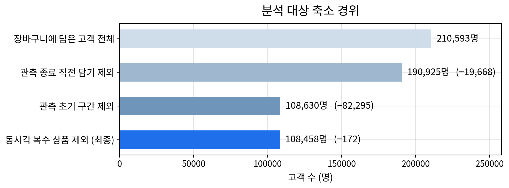
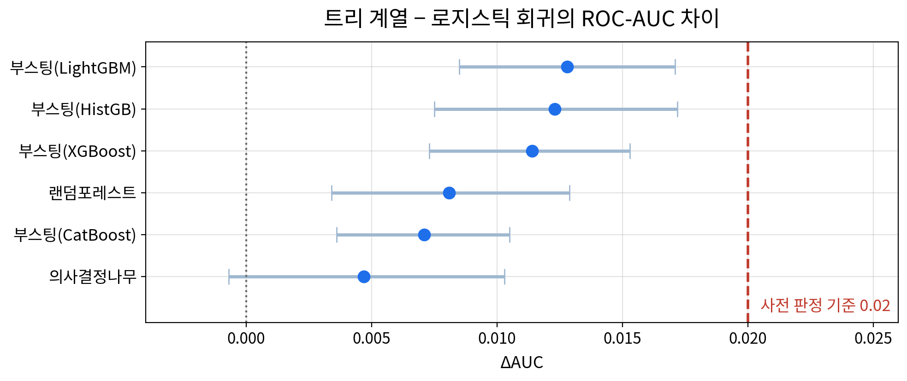
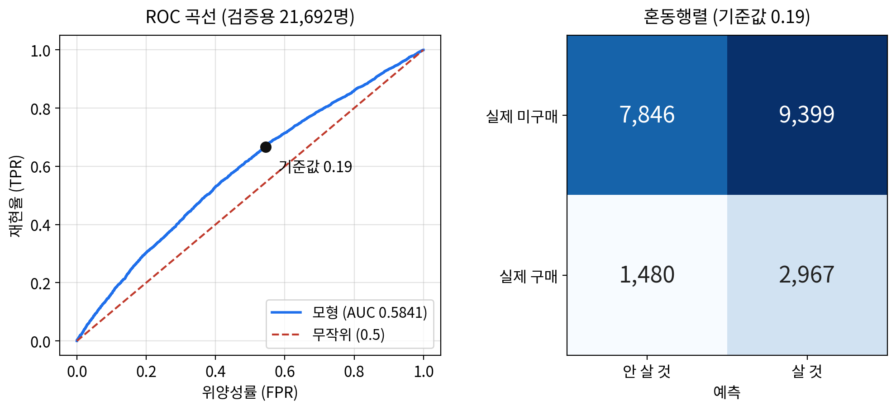
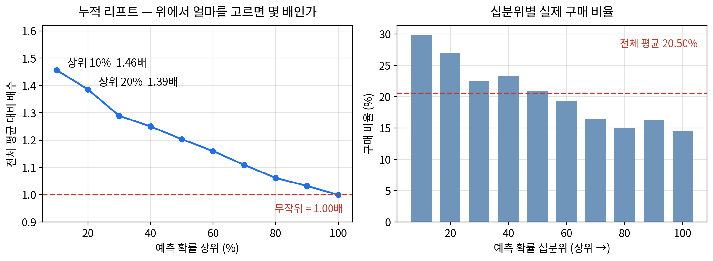
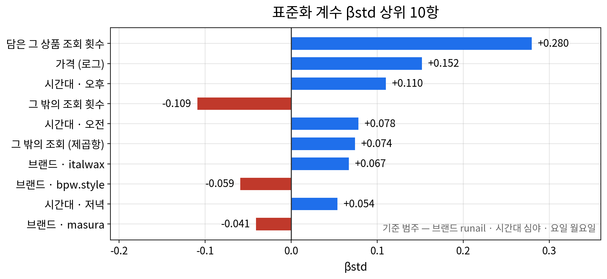

# 장바구니에 담은 상품의 7일 내 구매 여부를 담기 시점 정보로 구분할 수 있는가

**작성자:** bolly0809-coder &nbsp;&nbsp;|&nbsp;&nbsp; **공개본 점검일:** 2026-09-15

   

## 요약 (Executive Summary)

- **대상:** 화장품 온라인 스토어의 2019년 10~11월 행동 로그 8,738,120건
- **분석 단위:** 고객별 최초 장바구니 담기 1건, 최종 108,458명
- **목표:** 담은 시점까지 알 수 있는 정보로 같은 상품의 7일 내 구매 여부 분류
- **최종 모형:** 해석 중심 로지스틱 회귀, 검증용 ROC-AUC 0.5841
- **활용 범위:** 개별 고객 판정이 아닌 개입 후보의 상대적 우선순위 선별

> 고객의 반복 행동 로그를 그대로 모델에 넣지 않고 고객 1명당 최초 담기 1건으로 관측 단위를 다시 만들었다. 담은 뒤에 발생한 행동은 설명변수에서 제외하고, 관측 시작과 종료 때문에 정답이 왜곡되는 구간도 제거했다.
>
> 최종 모형의 판별력은 낮았지만 예측확률 상위 10%의 실제 구매 비율은 29.86%로 전체 평균 20.50%의 1.46배였다. 다만 그 집단에서도 70.1%가 구매하지 않았으므로 비용이 드는 개인 타기팅에는 적합하지 않다.



**상세 분석 노트북:** [품질 점검·관측 단위 변환·모형 검증](cart-conversion-analysis.ipynb)

본 프로젝트는 2인 팀으로 진행했다. 저장소에는 개인정보와 대용량 원본 로그를 제외하고 공개 가능한 분석 구조와 검증된 집계 결과만 정리했다.

## 핵심 결과

| 항목 | 확인한 결과 |
|---|---|
| 원본 데이터 | 8,738,120행 × 9열, 2019년 10~11월 |
| 품질 점검 후 | 중복·가격 0 이하 기록 제거 후 8,259,159행 |
| 최종 분석 대상 | 고객 108,458명, 구매 22,236명(20.50%) |
| 학습·검증 분할 | 86,766명 / 21,692명, 층화 80:20 |
| 최종 모형 | 로지스틱 회귀, 범주 더미와 곡선항 포함 28개 항 |
| 검증 성능 | ROC-AUC 0.5841, PR-AUC 0.2609, F1 0.3529 |
| 분류 기준값 | 학습용 F1이 가장 높은 0.19 |
| 상위 10% | 구매 비율 29.86%, 누적 리프트 1.46배 |
| 가장 큰 신호 | 담기 직전 30분에 담은 상품을 본 횟수, 표준화 계수 +0.280 |
| 일반화 진단 | 학습 0.5915, 5겹 교차검증 0.5900, 검증 0.5841 |

## 분석 구조

```mermaid
flowchart LR
    A[월별 행동 로그 874만 건] --> B[중복·무효값·시간대 점검]
    B --> C[고객별 최초 담기 1건]
    C --> D[관측 초기·종료 구간 제외]
    D --> E[담기 이전 30분 행동 집계]
    E --> F[고객 단위 마스터 108,458명]
    F --> G[층화 분할과 전처리]
    G --> H[로지스틱 회귀]
    H --> I[교차검증·트리 6종 대조]
    I --> J[우선순위와 활용 한계 해석]
```



### 1. 데이터 품질과 시간 기준

[REES46가 공개한 화장품 스토어 행동 로그](https://www.kaggle.com/datasets/mkechinov/ecommerce-events-history-in-cosmetics-shop)의 2019년 10월과 11월 파일을 사용했다. 한 행은 조회, 장바구니 담기, 담기 취소 또는 구매 행동 하나다.

- 고객·상품·행동·시각이 같은 461,449행을 제거했다. 이 가운데 459,848행은 9개 열이 모두 같은 완전 중복이었다.
- 가격이 0 이하인 17,512행을 무효값으로 제외했다.
- `category_code`는 98.32%가 비어 있고 남은 값도 데이터 설명과 맞지 않아 사용하지 않았다.
- 제공처가 이용자 시간대를 밝히지 않아 활동 분포를 근거로 UTC+3을 적용했다. 이 판단은 분석 한계로 남겼다.

### 2. 고객 단위 표본과 목표변수

한 고객이 여러 행동을 남기므로 이벤트 한 건을 독립 관측치로 쓰면 같은 고객의 습관이 반복 집계된다. 고객별 최초 장바구니 담기 1건만 남겨 한 행이 고객 한 명을 뜻하도록 바꿨다.

```text
purchase_7d = 최초 담기 시각 이후 7일 안에 같은 고객이 같은 상품을 구매하면 1, 아니면 0
```

관측 종료 직전 담기 19,668명은 7일을 끝까지 볼 수 없어 제외했다. 관측 초기 구간에는 기록 시작 전부터 이용한 고객이 한꺼번에 잡혀 조회와 구매의 관계가 뒤집혔다. 담기 인원과 조회 보유율이 함께 안정되는 2019년 10월 11일 이전 82,295명도 제외했다. 같은 초에 여러 상품을 처음 담아 기준 상품을 정할 수 없는 172명을 추가로 제외해 최종 표본을 확정했다.

### 3. 설명변수와 정보 누수 차단

설명변수는 담는 순간까지 알 수 있는 정보만 사용했다.

| 영역 | 최종 변수 |
|---|---|
| 상품 조건 | 가격, 브랜드 묶음 |
| 직전 탐색 | 이전 30분 전체 조회 횟수, 같은 상품 조회 횟수 |
| 담기 상황 | 시간대, 요일 |

담기 취소, 구매까지 걸린 시간처럼 담은 뒤에만 알 수 있는 값은 제외했다. 전체 조회 횟수와 조회 상품 종류 수의 상관이 0.988이어서 후자를 제거했고, 조회 여부도 전체 조회 횟수와 완전히 겹쳐 제외했다. 이 과정으로 최대 분산팽창계수를 20.218에서 1.249로 낮췄다.

### 4. 전처리와 모형 선택

학습·검증 분할을 먼저 수행해 검증용 정보가 전처리 기준에 섞이지 않게 했다. 가격에는 로그 변환을, 두 조회 횟수에는 `log1p`를 적용했다. 범주형 변수의 기준 범주는 이름순 기본값을 사용하지 않고 표본 규모와 순서 정의에 따라 지정했다.

로지스틱 회귀의 로짓 선형성을 순차적으로 확인한 결과 전체 조회 횟수에서 먼저 위배가 나타났고, 처방 후 재검정에서는 같은 상품 조회 횟수도 위배됐다. 두 변수에 중심화한 제곱항을 추가한 뒤 위배가 해소됐다. 고객당 한 행으로 독립성을 확보했고 최종 모형의 최대 VIF는 3.38이었다.

트리 계열 6종을 같은 데이터 분할과 변수로 비교했다. LightGBM이 ROC-AUC 0.5969로 가장 높았지만 로지스틱 회귀보다 0.0128 높은 수준이었다. 사전에 정한 0.02 기준보다 작아, 변수의 방향과 크기를 설명할 수 있는 로지스틱 회귀를 최종 모형으로 유지했다.



## 모형 평가

검증용 21,692명에서 ROC-AUC는 0.5841이었다. 예측확률이 0.5를 넘는 고객이 없어, 검증용 데이터를 보기 전에 학습용에서 F1이 가장 높은 0.19를 기준값으로 정했다. 이 기준에서 정밀도 0.2399, 재현율 0.6672, F1 0.3529였다.



학습용 ROC-AUC 0.5915와 5겹 교차검증 0.5900의 차이는 0.0015였다. 프로젝트에서 미리 정한 판정 규칙에 따르면 과적합보다 낮은 설명력에 따른 과소적합에 해당한다. 비선형 모형의 개선 폭도 작아 단순히 알고리즘을 복잡하게 바꾸는 것만으로 해결하기 어렵다고 판단했다.



## 변수 해석

표준화 계수 기준으로 가장 큰 신호는 담은 상품의 직전 조회 횟수였다. 가격과 오후 시간대가 뒤를 이었다. 전체 조회 횟수의 조건부 방향은 음수였는데, 전체 조회 안에 같은 상품 조회가 포함되어 있기 때문이다. 같은 상품 조회를 고정하면 남는 값은 주로 다른 상품을 둘러본 양으로 해석된다.



- 같은 상품을 2회 이상 본 고객은 6,071명이며 구매 비율은 28.84%였다.
- 범위를 1회 이상으로 넓히면 41,968명, 구매 비율 24.88%로 대상은 커지지만 선별력은 낮아졌다.
- 구매자의 63.57%가 담은 뒤 1시간 안에 구매했다. 담기 이전 정보만으로 이후 구매를 구분할 여지가 좁았던 이유 중 하나다.

## 활용 제안

이 모형은 개별 고객에게 쿠폰이나 메시지를 발송할 근거로 쓰기에는 오탐이 많다. 추가 비용이 거의 들지 않는 장바구니 화면 내 상품 정보 재노출이나 비교 정보 배치의 우선순위를 정하는 보조 신호로 범위를 제한했다.

반복 조회 고객은 전체의 5.6%로 규모가 작지만 상대적으로 구매 비율이 높았다. 저가 상품 장바구니는 상대적으로 방치되는 비율이 높아 묶음 구성이나 배송비 조건을 별도 실험할 후보가 된다. 이는 관측 데이터의 연관성을 바탕으로 한 제안이며 실제 효과는 A/B 테스트로 확인해야 한다.

## 팀 역할 배분과 내 담당 역할

프로젝트 참여자는 총 2명이며, 본인을 제외한 구성원은 역할명으로 익명화했다. 작업 계획서와 노트북별 산출물을 기준으로 담당 범위를 정리했다.

| 구성원 | 담당 영역 |
|---|---|
| **배지환(본인)** | **담기 이전 30분 행동 파생변수 생성, 가격·브랜드·시간대·요일의 단변량·이변량 분석, 조회 변수 분석 결과 교차 검수** |
| 팀원 A | 조회 행동 변수의 단변량·이변량 분석, 상품·상황 변수 분석 결과 교차 검수 |
| 공동 | 문제 정의, 품질 점검과 표본 확정, 로지스틱 회귀·트리 비교, 보고서와 발표자료 작성 |

두 사람이 자신이 만들지 않은 변수와 결과를 다시 계산하는 방식을 사용했다. 검수 장부 243개 항목 가운데 241개가 일치했고 2개는 원 보고값이 없어 대조할 수 없었으며, 불일치는 0개였다. 목표변수도 수기 사례 확인과 전수 재계산을 함께 적용했다.

## 공개 파일과 데이터 범위

- `README.md`: 문제 정의, 검증된 결과, 역할과 한계
- `cart-conversion-analysis.ipynb`: 공개 가능한 데이터 처리·검증 코드와 집계 결과
- `assets/`: 표본 확정, 모형 평가와 변수 해석 시각자료

원본 CSV는 약 1GB이며 사용자·세션 식별자가 포함되어 저장소에 올리지 않았다. 전체 중간 테이블과 개별 고객 예측값도 공개하지 않는다. 노트북 전체를 다시 실행하려면 Kaggle 원본 파일이 필요하다.

## 한계

- 7일이 지난 뒤 같은 상품을 구매한 2,267건은 목표변수에서 미구매로 기록된다.
- 미구매 86,222명 가운데 6,460명(7.49%)은 7일 안에 다른 상품을 구매했다.
- 시간대 UTC+3과 관측 초기 제외 기준은 문서로 확인한 값이 아니라 행동 분포를 근거로 정했다.
- 브랜드 결측은 `미상` 범주로 유지했으며 결측 발생 원인은 확인할 수 없다.
- 상품 카테고리 통제가 제한되어 가격 계수에 남은 교란 가능성이 있다.
- 2019년의 한 화장품 스토어 두 달 기록이므로 다른 업종과 시점으로 일반화할 수 없다.
- 예측 성능이 낮고 상위 집단의 오탐도 높다. 실제 개입 전에는 최신 데이터 재학습과 비용 기반 검증이 필요하다.

## 회고

행동 로그의 행 수가 많아도 질문에 맞는 관측 단위와 시간 창을 정의하지 않으면 표본 수가 오히려 분석을 왜곡할 수 있었다. 고객 1명당 한 행으로 바꾸고 담기 이후 정보를 차단한 뒤에도 성능이 낮다는 사실을 그대로 남겼다. 높은 점수를 만드는 것보다 어떤 판단에는 쓸 수 있고 어디부터는 쓸 수 없는지 구분하는 일이 이 프로젝트의 핵심이었다.
