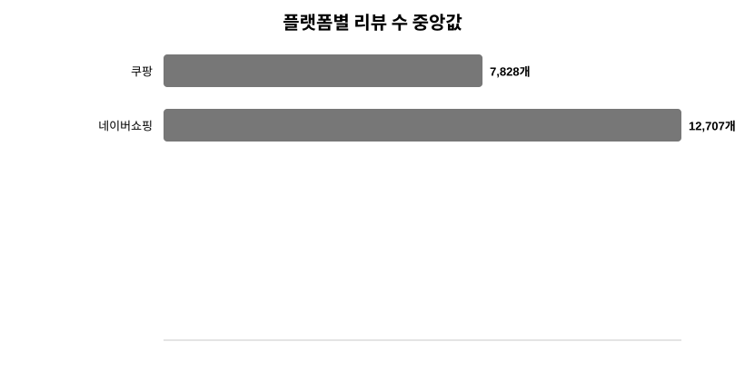
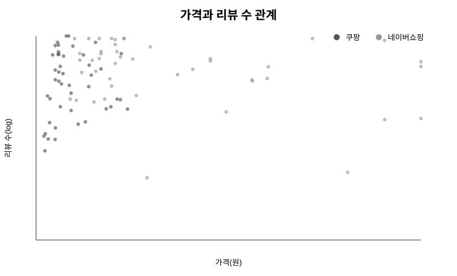
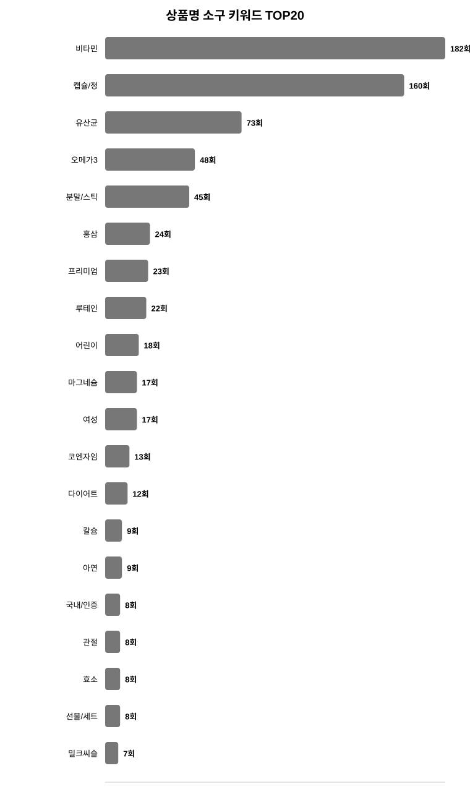
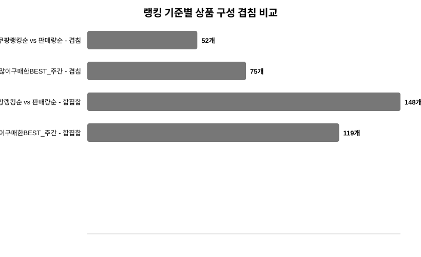

# Ecommerce Ranking Analysis

쿠팡·네이버쇼핑 건강식품 랭킹 상품 데이터를 수집해 **가격, 리뷰 수, 평점, 상품명 소구 키워드, 랭킹 기준별 상품 구성 차이**를 분석한 미니 프로젝트입니다.

> 본 프로젝트는 광고/커머스 데이터 분석 직무 지원을 위한 보조 포트폴리오로, 실제 광고 클릭·전환 데이터가 없는 상황에서 이커머스 랭킹 상품 정보를 구조화하고 상품 경쟁력과 구매 판단 신호를 탐색하는 데 목적이 있습니다.

---

## 1. Project Overview

건강식품 카테고리는 온라인 광고, 검색 노출, 리뷰 축적, 재구매 경쟁이 활발한 영역입니다.  
이 프로젝트에서는 쿠팡과 네이버쇼핑의 건강식품 랭킹 상품 데이터를 수집하고, 플랫폼별·랭킹 기준별 상품 특성을 비교했습니다.

분석의 초점은 다음과 같습니다.

- 플랫폼별 랭킹 상품의 가격대 차이
- 리뷰 수와 평점으로 본 사용자 반응 신호
- 랭킹 기준별 상품 구성 안정성
- 상품명에 반복되는 성분·기능·타겟·제형 중심 소구 키워드
- 광고/커머스 성과 분석 관점에서의 해석 가능성

---

## 2. Data Collection

| Platform | Category | Ranking Type | Rows |
|---|---|---|---:|
| 쿠팡 | 헬스/건강식품 | 쿠팡랭킹순 | 100 |
| 쿠팡 | 헬스/건강식품 | 판매량순 | 100 |
| 네이버쇼핑 | 건강식품 | 많이구매한BEST 일간 | 100 |
| 네이버쇼핑 | 건강식품 | 많이구매한BEST 주간 | 100 |

- 수집일: 2026-06-01
- 원본 수집 데이터: 400행
- 플랫폼별 고유 상품 기준 데이터: 267개 상품

쿠팡 데이터는 옵션·수량만 다른 동일 상품이 반복 수집되는 문제가 있어, 수집 단계에서 상품명 정규화 기반 중복 방지 로직을 적용했습니다. 이후 분석 단계에서는 랭킹 기준별 원본 분석용 데이터와 고유 상품 기준 분석용 데이터를 분리했습니다.

---

## 3. Analysis Process

1. **Data Integration**
   - 쿠팡 랭킹순/판매량순, 네이버 일간/주간 데이터를 하나의 테이블로 통합

2. **Preprocessing**
   - 가격, 원래가격, 할인율, 리뷰 수, 평점 숫자형 변환
   - 상품명 정규화 및 `product_key` 생성
   - `price_group`, `review_group`, `is_top20`, `log_review_count` 파생변수 생성

3. **Duplicate & Overlap Analysis**
   - 쿠팡 랭킹순 vs 판매량순 겹침 확인
   - 네이버 일간 vs 주간 BEST 겹침 확인
   - 원본 랭킹 기준 데이터와 고유 상품 기준 데이터 분리

4. **EDA**
   - 플랫폼별 가격·리뷰 수·평점 분포 비교
   - 리뷰 수 TOP20, 가격 상위/하위 상품 확인

5. **Keyword Analysis**
   - 건강식품 상품명 소구 키워드 사전 작성
   - 성분, 기능, 타겟, 제형 중심 키워드 빈도 분석

6. **Insight Summary**
   - 광고/커머스 분석 관점에서 해석 가능한 핵심 인사이트 도출

---

## 4. Key Findings

### Insight 1. 네이버쇼핑 구매 BEST 상품은 쿠팡 랭킹 상품보다 가격대가 높게 나타났습니다.

- 네이버쇼핑 고유 상품 가격 중앙값: **62,900원**
- 쿠팡 고유 상품 가격 중앙값: **15,380원**

네이버쇼핑 구매 BEST에는 상대적으로 고가·프리미엄 상품이 많이 포함되고, 쿠팡 랭킹 상품에는 저가~중가 상품이 많이 포함된 것으로 해석할 수 있습니다.

### Insight 2. 네이버쇼핑은 고가 상품뿐 아니라 리뷰 축적량도 상대적으로 높았습니다.

- 네이버쇼핑 리뷰 수 중앙값: **12,707개**
- 쿠팡 리뷰 수 중앙값: **7,828개**

리뷰 수는 실제 판매량이 아니라 구매 이력과 신뢰도의 대리 지표로 해석했습니다. 광고/커머스 분석에서는 가격뿐 아니라 리뷰 수와 평점 같은 사용자 반응 신호를 함께 봐야 합니다.

### Insight 3. 쿠팡은 랭킹 기준에 따라 상품 구성이 크게 달라졌습니다.

- 쿠팡랭킹순 vs 판매량순 겹침 상품 수: **52개**
- Jaccard 유사도: **0.351**

같은 카테고리 안에서도 랭킹 기준에 따라 상품 경쟁 구도가 다르게 보일 수 있음을 확인했습니다.

### Insight 4. 네이버쇼핑 일간/주간 구매 BEST는 상대적으로 안정적인 상품 구성을 보였습니다.

- 일간 vs 주간 겹침 상품 수: **75개**
- Jaccard 유사도: **0.630**

네이버쇼핑의 구매 상위 상품은 일간과 주간 기준에서 비교적 안정적으로 유지되는 경향을 보였습니다.

### Insight 5. 상품명에는 성분·기능·타겟·제형 중심 소구 키워드가 반복적으로 등장했습니다.

상위 키워드는 `캡슐/정`, `비타민`, `유산균`, `분말/스틱`, `오메가3`, `홍삼`, `프리미엄`, `마그네슘`, `여성`, `어린이` 등이었습니다.

상품명은 검색 결과 화면에서 사용자가 가장 먼저 접하는 정보이므로, 광고/커머스 관점에서는 클릭 전 구매 판단을 자극하는 소구 요소로 볼 수 있습니다.

---

## 5. Visualizations

### 플랫폼별 가격 분포


### 플랫폼별 리뷰 수 분포



### 가격과 리뷰 수 관계



### 상품명 소구 키워드 TOP20



### 랭킹 기준별 상품 구성 겹침 비교



---

## 6. Repository Contents

```text
ecommerce-ranking-analysis/
├── README.md
├── data/
│   ├── step5_platform_unique_summary.csv
│   ├── step5_overlap_summary.csv
│   ├── step6_keyword_overall.csv
│   └── step8_insight_cards.csv
├── images/
│   ├── price_distribution_by_platform.svg
│   ├── review_distribution_by_platform.svg
│   ├── price_vs_review_scatter.svg
│   ├── keyword_top20.svg
│   └── ranking_overlap_comparison.svg
└── scripts/
    ├── step2_preprocess_ecommerce.py
    ├── step5_6_core_keyword_analysis_ecommerce.py
    └── step7_visualization_ecommerce.py
```

---

## 7. Tech Stack

- Python
- pandas
- Selenium
- BeautifulSoup
- matplotlib
- 상품명 정규화
- 사전 기반 키워드 분석
- EDA / 시각화 / 리포팅

---

## 8. Limitations

- 본 데이터는 2026년 6월 1일 기준 특정 시점의 랭킹/구매 BEST 상품 스냅샷입니다.
- 실제 광고 노출, 클릭률, 구매전환율, 매출 데이터는 포함하지 않습니다.
- 리뷰 수는 판매량의 직접 지표가 아니라 구매 이력과 신뢰도의 대리 지표로 해석했습니다.
- 쿠팡과 네이버쇼핑은 랭킹 산정 방식과 제공 데이터 구조가 다르므로, 플랫폼 간 차이는 탐색적 비교로만 해석해야 합니다.
- 상품명 키워드 분석은 사전 기반 매칭 방식이므로, 사전에 포함되지 않은 표현은 반영되지 않을 수 있습니다.

---

## 9. Portfolio Relevance

이 프로젝트는 실제 광고 성과 데이터를 다루지는 않았지만, 광고/커머스 성과 분석에서 중요한 상품 정보와 사용자 반응 신호를 구조화하는 연습으로 수행했습니다.

특히 다음 역량을 보여주는 보조 포트폴리오로 활용할 수 있습니다.

- 이커머스 상품 데이터 수집
- 플랫폼별 데이터 구조 차이 정리
- 가격·리뷰 수·평점 전처리
- 상품명 키워드 기반 구매 소구 포인트 분석
- 랭킹 기준별 상품 구성 차이 해석
- 분석 결과를 광고/커머스 인사이트로 연결

> 참고: 전체 수집 원본 및 중간 처리 데이터는 파일 크기와 재현성 관리를 위해 별도 보관하고, GitHub에는 요약 데이터와 분석 코드 중심으로 공개했습니다.
