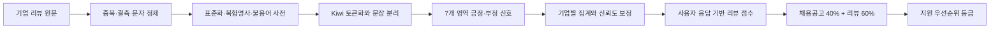

# 기업 리뷰와 채용공고를 결합해 지원 우선순위를 만들 수 있는가

**작성자:** bolly0809-coder &nbsp;&nbsp;|&nbsp;&nbsp; **공개본 점검일:** 2026-09-15

    

## 요약 (Executive Summary)

- **데이터:** 잡플래닛 기업 리뷰, 사람인·잡코리아 채용공고, 직무·임금·NCS 자료
- **규모:** 수집 리뷰 29,680건 → 최종 점수화 입력 21,197건 → 433개 기업 집계
- **최종 분석 단위:** 리뷰가 연결된 채용공고 515건, 383개 기업
- **문제 유형:** 텍스트마이닝 기반 의사결정 점수 설계

> 비정형 기업 리뷰를 복지·연봉·성장·워라밸·조직문화·안정성·직무적합의 7개 영역으로 구조화했다. 평점, 영역별 긍정·부정 신호, 전체 감성 신호와 사용자 선호를 결합해 기업별 리뷰 점수를 만들고, 리뷰 수가 적은 기업은 전체 평균 쪽으로 보정했다. 마지막으로 채용공고 점수 40%와 리뷰 점수 60%를 합쳐 공고별 지원 우선순위를 산출했다.
>
> 이 결과는 장기재직 확률을 예측한 값이 아니다. 실제 재직기간 라벨이 없어 **규칙 기반 의사결정 점수**로 해석해야 한다.

**상세 분석 노트북:** [기업 리뷰 전처리·점수화·채용공고 결합](job-review-scoring.ipynb)

본 프로젝트는 데이터 분석 부트캠프에서 6명이 수행한 팀 프로젝트다. 이 저장소는 제가 담당한 **기업 리뷰 전처리, 사전 구축, 영역별 신호 추출, 리뷰 점수화와 통합 테이블 구축**을 중심으로 재구성했다.

## 핵심 결과

| 항목 | 확인한 결과 |
|---|---|
| 리뷰 분석 입력 | 4차 정제본 21,197건, 중복 0건 |
| 리뷰 집계 | 433개 기업, 기업당 리뷰 수 중앙값 40건 |
| 사전 구성 | 표준화 194개 규칙, 복합명사 267개, 카테고리 단어 596개, 수동 불용어 177개 |
| 분석 영역 | 복지·연봉·성장·워라밸·조직문화·안정성·직무적합 7개 |
| 리뷰 점수 | 평균 65.1점, 중앙값 64.9점, 범위 40.1~90.0점 |
| 리뷰 등급 | 추천 129개, 조건부 추천 176개, 비추천 128개 기업 |
| 통합 테이블 | 공고 515건, 기업 383개, 27개 분석 열 |
| 대상 직무 | 백엔드 개발자 339건, 데이터 분석가 176건 |
| 통합 점수 | 평균 66.6점, 중앙값 67.0점, 범위 43.9~85.5점 |
| 최종 등급 | 추천 124건, 조건부 추천 255건, 비추천 136건 |

## 분석 구조



### 1. 리뷰 정제와 사전 구축

기업 리뷰의 장점, 단점과 경영진 제안 문장을 정제하고 Kiwi로 문장 분리와 형태소 분석을 수행했다. 표기 변형을 줄이기 위해 표준화 규칙을 적용하고 의미가 분리되면 안 되는 표현은 복합명사로 등록했다. 기업명과 직무명처럼 분석 의미를 왜곡할 수 있는 반복 표현은 불용어에 포함했다.

`pros`와 `cons` 열만으로 긍정·부정을 결정하지 않았다. 영역 토큰 주변 ±3개 토큰에서 긍정·부정 서술어를 찾고, 주변 신호가 없을 때만 장점·단점 열을 보조 기준으로 사용했다.

### 2. 기업별 리뷰 점수

기업 단위 집계에는 평점과 텍스트 신호를 함께 사용했다.

| 점수 단계 | 구성 |
|---|---|
| 평점 기반 점수 | 종합 15%, 복지 10%, 워라밸·문화·승진·경영진 각 15%, 추천율 10%, 성장률 5% |
| 기본 리뷰 점수 | 평점 기반 70%, 영역 텍스트 신호 20%, 전체 감성 신호 10% |
| 개인화 원점수 | 기본 리뷰 45%, Q1 중요 기준 25%, Q2 이직 위험 20%, Q3 업무방식 10% |
| 신뢰도 보정 | 리뷰 수에 따라 0.3·0.6·0.8·1.0의 신뢰도를 적용하고 전체 평균 쪽으로 축소 |
| 표시 점수 | 기업별 백분위를 40~90점으로 변환 |

리뷰가 5건 미만인 기업은 높은 표시 점수를 받아도 최고 등급을 조건부 추천으로 제한했다. 표시 점수 75점 이상은 추천, 55점 이상은 조건부 추천, 55점 미만은 비추천으로 구분했다.

표시 점수는 기업 간 상대적 위치다. 80점이 기업 품질 80점이나 장기재직 확률 80%를 뜻하지 않는다.

### 3. 채용공고 결합

기업명을 정규화한 뒤 리뷰가 연결된 공고만 남겼다. 공고의 직무 적합도, 정보 품질과 위험 신호를 반영한 `posting_final_score`에 40%, `review_final_score`에 60%를 적용했다.

```text
final_score = posting_final_score × 0.40 + review_final_score × 0.60
```

통합 점수가 72점 이상이면 추천, 60점 이상이면 조건부 추천, 60점 미만이면 비추천으로 분류했다. 72점은 통합 점수의 상위 약 25% 구간을 참고한 운영 기준이며, 실제 지원·입사·재직 성과로 최적화한 임계값은 아니다.

## 담당 역할과 팀 결과의 구분

| 구분 | 내용 |
|---|---|
| 직접 담당 | 리뷰 데이터 품질 점검과 전처리, 표준화·복합명사·카테고리·불용어 사전 정비 |
| 직접 담당 | 7개 영역의 긍정·부정 신호 추출, 기업별 집계, 리뷰 신뢰도·점수·등급 설계 |
| 협업 산출물 | 채용공고 점수와 리뷰 점수의 기업명 기준 병합, 서비스용 통합 테이블 구성 |
| 팀 산출물 | 채용공고 수집·점수화, 임금·NCS 진단, 서비스 화면, 머신러닝 실험과 발표자료 |

## 검증에서 확인한 문제

최종 제출 자료에는 랜덤 포레스트 정확도 0.8 이상이 제시되어 있다. 그러나 머신러닝용 `final_label`은 통합 점수에서 만든 등급이며, 입력 특성에는 등급을 직접 결정하는 `posting_final_score`와 `review_final_score`가 포함됐다. 두 점수를 40:60으로 합치면 타깃 등급을 거의 복원할 수 있으므로, 해당 정확도를 새로운 사용자의 장기재직 예측 성능으로 해석하기 어렵다.

이번 공개본에서는 머신러닝 정확도를 핵심 성과에서 제외했다. 규칙 기반 점수 설계와 데이터 통합 과정을 결과로 제시하고, 예측 모델은 실제 입사 여부와 재직기간 라벨을 확보한 뒤 별도 평가 자료로 다시 검증해야 한다고 정리했다.

## 공개 파일과 데이터 범위

- `README.md`: 프로젝트 요약, 점수 구조, 결과와 한계
- `job-review-scoring.ipynb`: 공개 가능한 코드 구조와 검증된 집계 수치를 담은 재구성 노트북
- 상세 포트폴리오: [Notion 프로젝트 페이지](https://www.notion.so/36fb1b26b8cc816faebefb7c73f2cbd6)

잡플래닛 리뷰 원문, 기업별 상세 점수, 사전 엑셀, 채용공고 URL, SQLite 데이터베이스, 크롤링 세션, 팀 내부 제출본은 저장소에 포함하지 않는다. 데이터 라이선스와 리뷰 작성자 보호를 위한 조치다.

공개 노트북은 원본 파이프라인을 설명할 수 있도록 핵심 함수와 집계 결과를 재구성했다. 전체 재실행에는 비공개 원본 데이터, 사용자 사전, Kiwi 형태소 분석기와 채용공고 분석 테이블이 필요하다.

## 한계

- 리뷰 작성자는 전체 재직자를 대표하지 않을 수 있고 기업별 리뷰 수와 작성 시점도 다르다.
- 사전 기반 영역·감성 분류의 정밀도와 재현율을 별도의 수작업 라벨 표본으로 검증하지 못했다.
- 백분위 표시 점수, 질문 가중치, 40:60 통합 비율과 등급 임계값은 서비스 규칙이다. 장기재직이나 지원 전환에 대한 인과효과를 의미하지 않는다.
- 실제 클릭·저장·지원·입사·재직기간 데이터가 없어 추천 결과의 효과를 측정하지 못했다.
- 실시간 채용공고 API를 연결하지 못해 제출 시점의 정적 데이터로 분석했다.

## 회고

비정형 리뷰를 바로 하나의 감성 점수로 축약하지 않고, 구직자가 확인하려는 영역과 리뷰 수의 차이를 점수 구조에 반영했다. 동시에 상대평가 점수와 임의 가중치의 한계를 명시했다. 기존 머신러닝 결과도 입력 특성과 타깃 생성 과정을 다시 대조해 순환 구조를 확인했고, 검증되지 않은 정확도 대신 재현 가능한 데이터 처리와 점수 설계를 중심 성과로 정리했다.
