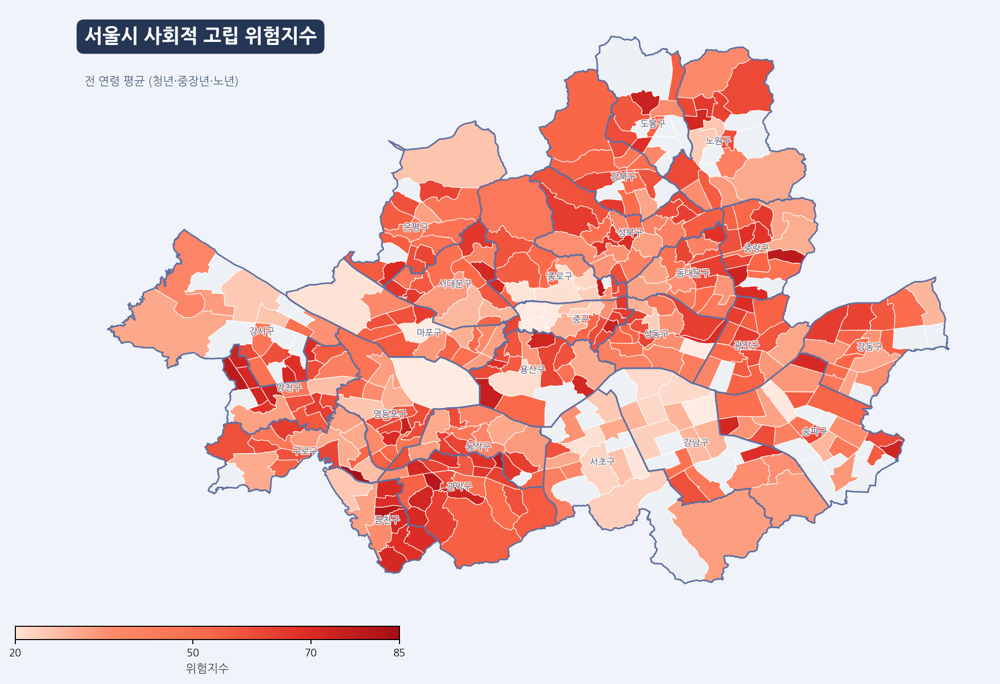
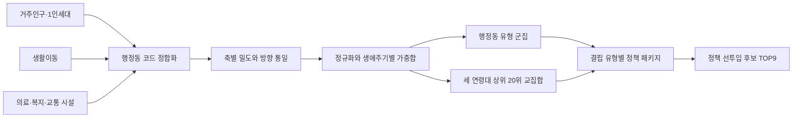
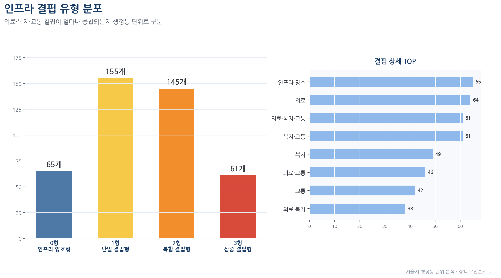
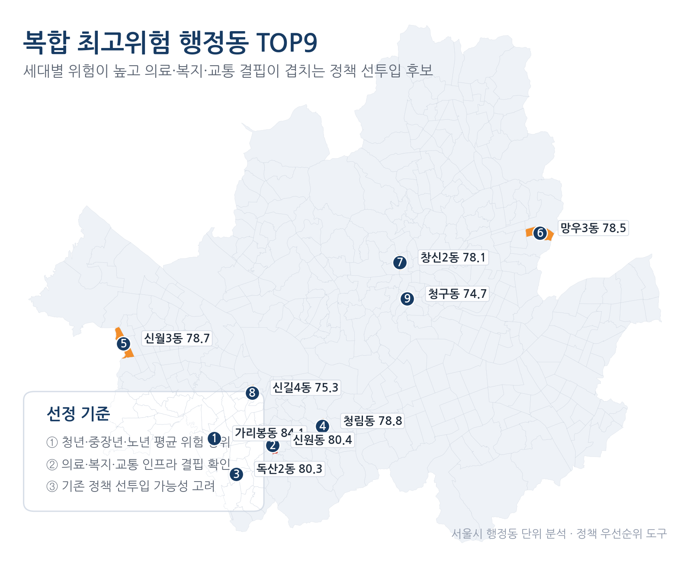

# 서울시 생애주기별 사회적 고립 취약지역을 행정동 단위로 찾을 수 있는가

**작성자:** bolly0809-coder &nbsp;&nbsp;|&nbsp;&nbsp; **공개본 점검일:** 2026-09-15

    

## 요약 (Executive Summary)

- **대상:** 서울시 행정동 경계 426개
- **분석 가능 범위:** 청년·중장년·노년 위험지수가 모두 산출된 378개 행정동
- **데이터:** 거주인구, 1인세대, 생활이동, 의료·복지·교통 인프라, 외부 취약지표
- **결과물:** 생애주기별 위험지수, 행정동 유형 4종, 전생애 중첩위험 TOP9, 정책 패키지
- **문제 유형:** 지역 단위 규칙 기반 정책 의사결정 지원

> 인구 구조, 생활이동과 생활 인프라를 행정동 단위로 결합해 청년·중장년·노년의 상대적 고립 취약도를 각각 계산했다. 세 연령대에서 반복적으로 위험도가 높은 9개 행정동을 찾고, 의료·복지·교통 결핍 유형에 맞춰 기존 서울시 정책의 우선 연결안을 제시했다.
>
> 이 지수는 개인의 사회적 고립 여부나 고독사 확률을 예측하지 않는다. 행정동 간 상대적 취약도를 비교해 추가 점검이 필요한 지역을 좁히는 선별 도구다.



**상세 분석 노트북:** [생애주기별 위험지수·군집·교차검증](isolation-risk-analysis.ipynb)

본 프로젝트는 서울시 빅데이터 활용 경진대회에 출품한 2인 팀 프로젝트다. 이 저장소는 공개 가능한 분석 구조와 검증된 결과를 중심으로 재구성했다.

## 핵심 결과

| 항목 | 확인한 결과 |
|---|---|
| 기준 공간 단위 | 서울시 행정동 426개, 행정동 코드 중복 0건 |
| 위험지수 산출 | 청년 379개, 중장년 379개, 노년 378개 |
| 완전 사례 | 세 위험지수가 모두 존재하는 378개 행정동 |
| 70점 이상 지역 | 청년 40개, 중장년 52개, 노년 26개 |
| 연령별 최고점 | 청년 가리봉동 83.6점, 중장년 신원동 84.4점, 노년 가리봉동 84.5점 |
| 행정동 유형 | 1인가구 집중형 78개, 도심상업형 30개, 활동적 도심형 129개, 생활안정형 141개 |
| 인프라 결핍 | 양호 65개, 단일 결핍 155개, 복합 결핍 145개, 삼중 결핍 61개 |
| 중첩위험 | 세 연령대별 상위 20위에 모두 포함된 행정동 9개 |
| 최종 테이블 | 426행 × 36열, 위험·군집·인프라 결핍·정책 정보 통합 |

위험지수 결측으로 48개 행정동은 군집에서 미분류 처리했다. 따라서 네 가지 군집의 개수는 완전 사례 378개를 기준으로 해석해야 한다.

## 분석 구조



### 1. 행정동 단위 데이터 결합

서울시 빅데이터캠퍼스의 B031 거주인구와 B076 생활이동 자료를 행정동 코드로 정합화했다. 행정안전부 1인세대 자료와 의료·복지·교통시설 자료도 같은 공간 단위로 변환했다. 시설 수는 인구 또는 면적 대비 밀도로 바꾸고, 극단값의 영향을 줄이기 위해 상위 1%를 절삭한 뒤 0~100 범위로 정규화했다.

원천 자료의 행정동 코드와 시점이 완전히 일치하지 않아 지표별 결측이 남았다. 결과 테이블은 426개 행정동을 유지하되 위험지수와 군집 분석은 유효한 행만 사용했다.

### 2. 생애주기별 복합위험지수

모든 축은 값이 높을수록 상대적 위험이 커지도록 방향을 통일했다. 1인가구 집중도는 위험 방향으로, 생활이동과 인프라 접근성은 값이 낮을수록 위험이 커지도록 역방향 점수로 변환했다.

```text
청년 위험지수   = 인구 집중도 × 0.20 + 이동 저하 × 0.40 + 인프라 결핍 × 0.40
중장년 위험지수 = 인구 집중도 × 0.20 + 이동 저하 × 0.40 + 인프라 결핍 × 0.40
노년 위험지수   = 인구 집중도 × 0.20 + 이동 저하 × 0.35 + 인프라 결핍 × 0.45
```

청년·중장년 인프라 점수는 의료 50%와 교통 50%를 결합했다. 노년층은 복지 60%, 의료 25%, 교통 15%로 구성해 근거리 돌봄·복지 접근성을 더 크게 반영했다. 가중치는 정책 우선순위 비교를 위한 분석 규칙이며, 실제 고립 결과로 학습한 계수가 아니다.

### 3. 군집과 인프라 결핍 유형

세 연령대 위험지수가 모두 있는 378개 행정동을 K-Means로 네 유형으로 나눴다. 군집은 위험 등급이 아니라 비슷한 인구·이동·인프라 구조를 가진 지역을 묶은 결과다.

별도로 의료·복지·교통 밀도의 하위 30% 여부를 계산해 양호, 단일 결핍, 복합 결핍, 삼중 결핍으로 구분했다. 이 결핍 유형을 이용해 방문건강관리, 돌봄SOS, 서울동행맵 등 기존 정책의 조합을 다르게 연결했다.



### 4. 전생애 중첩위험 TOP9

청년·중장년·노년 위험지수에서 각각 상위 20개 행정동을 구한 뒤 세 집합의 교집합을 계산했다. 교집합 9곳의 세 위험지수 평균으로 우선순위를 정했다.

| 순위 | 행정동 | 평균 위험지수 |
|---:|---|---:|
| 1 | 가리봉동 | 84.1 |
| 2 | 신원동 | 80.4 |
| 3 | 독산2동 | 80.3 |
| 4 | 청림동 | 78.8 |
| 5 | 신월3동 | 78.7 |
| 6 | 망우3동 | 78.5 |
| 7 | 창신2동 | 78.1 |
| 8 | 신길4동 | 75.3 |
| 9 | 청구동 | 74.7 |



### 5. 외부 지표와의 정합성 확인

25개 자치구 평균 위험지수와 기초생활수급자 비율의 Spearman 순위상관을 확인했다. 청년 ρ=0.625(p=0.001), 중장년 ρ=0.592(p=0.002), 노년 ρ=0.413(p=0.040)으로 모두 양의 상관이 나타났다. 행정동 단위 노년 위험지수와 독거노인 비율도 ρ=0.278(p<0.001)의 양의 상관을 보였다.

자살률과의 상관은 청년 ρ=0.274(p=0.185), 중장년 ρ=0.246(p=0.237), 노년 ρ=0.298(p=0.148)로 통계적으로 유의하지 않았다. 이 검증은 지수의 인과효과나 개인 고립 여부를 입증하지 않으며, 외부 생활취약 지표와 방향이 일치하는지 확인한 보조 검증이다.

## 팀 역할 배분과 내 담당 역할

프로젝트 참여자는 총 2명이며, 본인을 제외한 구성원은 역할명으로 익명화했다. 제출 폴더의 개인 산출물을 기준으로 담당 범위를 정리했다.

| 구성원 | 담당 영역 |
|---|---|
| **배지환(본인)** | **빅데이터캠퍼스 원천 데이터 컬럼 슬림화, 중장년·노년 지표 전처리·점수화 파이프라인 정비, 실행·반출 절차 문서화** |
| 팀원 A | 청년층 지표 전처리·위험지수 산출, 결과 시각화와 발표자료 구성 |
| 공동 | 분석 주제·지표 설계, 행정동 단위 결과 통합, 군집·교차검증, TOP9 정책 패키지와 최종 제출물 검토 |

### 세부 담당 범위

- 대용량 B040 원천 자료에서 중장년·노년 분석에 필요한 열만 남기는 슬림화 작업을 구성했다.
- 중장년층을 40~64세, 노년층을 65세 이상으로 분리하고 두 연령군의 데이터 로딩·전처리·지표 산출·점수화 흐름을 모듈화했다.
- 서울시 빅데이터캠퍼스 환경에서 중장년·노년 파이프라인을 실행할 수 있도록 실행 가이드와 반출 제약 대응 사항을 정리했다.
- 팀 산출물의 위험지수와 최종 통합 결과를 대조해 계산식, 행정동 수, 결측 범위와 정책 매핑 결과를 점검했다.

## 공개 파일과 데이터 범위

- `README.md`: 프로젝트 요약, 검증된 결과, 역할과 한계
- `isolation-risk-analysis.ipynb`: 지수·군집·TOP9·교차검증의 공개 가능한 코드 구조
- `assets/`: 종합 위험지도, 인프라 결핍 분포와 TOP9 지도

B031·B076 등 서울시 빅데이터캠퍼스 원본, 개인·통신 기반 상세 자료, 전체 중간 산출물과 내부 제출 파일은 저장소에 포함하지 않는다. 공개 노트북 전체를 다시 실행하려면 원본 데이터와 행정동 코드 매핑 자료가 필요하다.

## 한계

- 1인가구 비율, 이동량과 인프라 접근성은 사회적 고립의 직접 측정값이 아니라 대리 지표다.
- 행정동 단위 결과를 해당 지역 주민 개인의 상태로 해석하면 생태학적 오류가 발생할 수 있다.
- 위험지수가 완성되지 않은 48개 행정동은 군집에서 제외됐으며, 자료 결합 공백이 공간 비교에 영향을 줄 수 있다.
- 중장년층을 40~64세로 묶어 40대와 고독사 비중이 높은 50·60대의 차이를 분리하지 못했다.
- 일부 외부 검증은 25개 자치구 단위여서 행정동 위험지수와 공간 해상도가 다르다.
- 가중치, 상위 20위 교집합과 하위 30% 결핍 기준은 운영 규칙이다. 실제 정책 성과로 최적화한 기준이 아니다.
- 정책지원 플랫폼은 화면 시안이며 담당자 인터뷰, 사용자 테스트와 실제 정책 효과 검증을 거치지 않았다.

## 회고

사회적 고립처럼 직접 관측하기 어려운 문제를 다룰 때는 대리 지표를 많이 모으는 것보다 공간 단위, 방향과 해석 범위를 먼저 맞추는 일이 중요했다. 426개 행정동을 기준 테이블로 유지하면서도 실제 점수·군집 분석의 유효 표본은 378개임을 분리해 공개했다. 정책 제안 역시 새로운 사업을 단정하기보다, 결핍 유형에 따라 기존 정책을 먼저 연결할 후보지를 좁히는 수준으로 한정했다.
