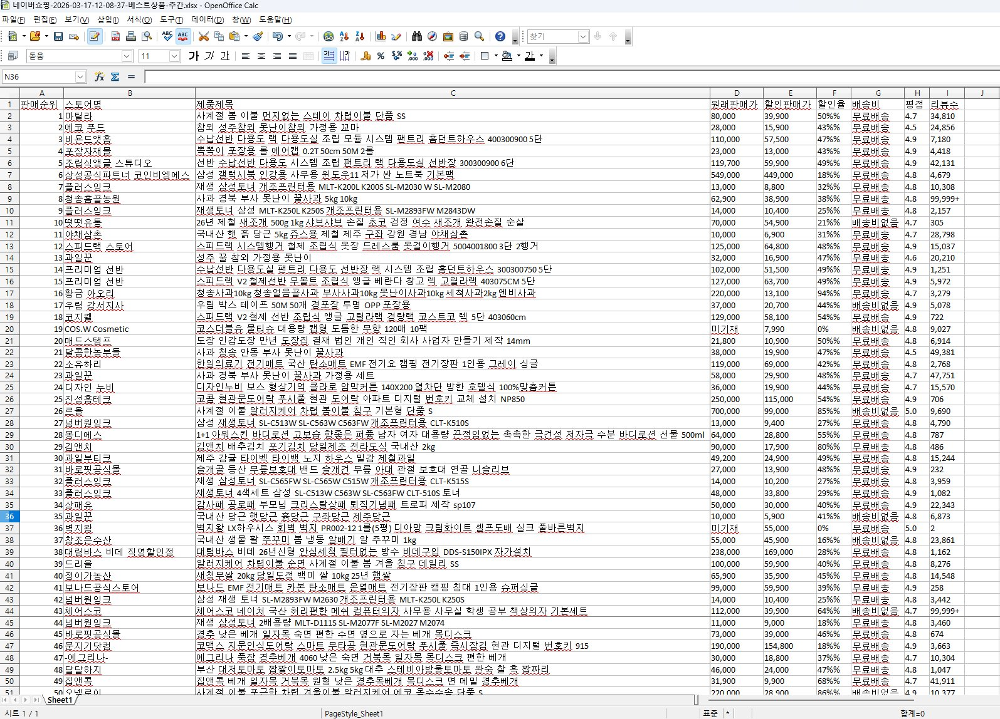
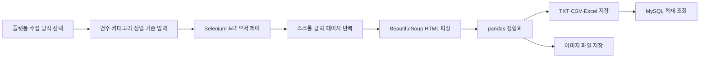

# 오픈마켓·SNS 웹 데이터 수집·정리 자동화

**작성자:** bolly0809-coder &nbsp;&nbsp;|&nbsp;&nbsp; **공개본 점검일:** 2026-09-15 &nbsp;&nbsp;|&nbsp;&nbsp; **유형:** 개인 프로젝트

    

## 요약

- **목적:** 오픈마켓 상품과 SNS 게시물·댓글 정보를 반복 수집하고 정형 파일 또는 데이터베이스로 저장하는 흐름 구현
- **구현 범위:** 오픈마켓 4곳과 SNS 3종의 수집 절차, 사용자 입력, 브라우저 제어, HTML 파싱, 결과 저장
- **출력:** TXT·CSV·Excel, 상품·프로필 이미지, MySQL 테이블
- **문서화:** 18개 화면에 실행 방법, 단계별 코드 설명, 변수 명세와 결과 캡처를 담은 단일 HTML 포트폴리오

학습·실습 과정에서 작성한 플랫폼별 크롤링 코드를 하나의 서비스형 문서로 재구성했다. 수집 대상을 선택하고 필요한 입력값과 저장 형식을 확인한 뒤, 코드와 결과를 같은 화면에서 살펴볼 수 있도록 구성했다.

이 프로젝트는 현재 운영 중인 범용 크롤링 서비스가 아니다. 웹사이트 구조와 이용 정책이 바뀌면 선택자와 실행 조건을 다시 점검해야 하는 **수집 자동화 구현·문서화 사례**다.



## 인터랙티브 문서

- [웹 데이터 수집·정리 자동화 포트폴리오 HTML](./index.html)
- GitHub에서는 HTML 소스가 표시될 수 있다. 인터랙티브 화면은 파일을 내려받아 브라우저에서 열면 확인할 수 있다.
- HTML 한 파일에 스타일, 화면 전환 코드와 결과 이미지 11개를 포함해 별도 리소스 없이 열 수 있도록 구성했다.

## 구현한 수집 범위

### 오픈마켓

- **네이버쇼핑:** 전체·카테고리별 베스트 상품, 일간·주간 기준, 최대 100건 수집
- **G마켓:** 전체·카테고리별 베스트 상품, 최대 200건 수집, 상품 이미지 저장
- **쿠팡:** 15개 카테고리와 5개 정렬 기준에 따른 상품 정보 수집
- **마켓컬리:** 추천·신상품·판매량·혜택·가격순 상품 정보 수집
- **MySQL 연동:** 네이버쇼핑 Excel 결과를 `best_seller` 테이블에 적재하고 전체 또는 선택 열 조회

11번가와 아마존은 HTML 화면에 향후 구현 대상으로만 표시했으며, 완료 기능에 포함하지 않았다.

### SNS

- **유튜브 숏츠:** URL 직접 입력 또는 키워드 검색을 통해 영상별 댓글 수집
- **유튜브 일반 영상:** 댓글 언어 감지와 한국어 번역 결과를 함께 저장
- **인스타그램 게시물:** 키워드·해시태그·계정 검색, 여러 계정 일괄 수집 또는 계정별 수량 지정
- **인스타그램 프로필:** 게시물·팔로워·팔로우 수, 소개글과 프로필 이미지 수집

댓글 작성자 ID처럼 개인 식별 가능성이 있는 항목이 포함된 결과 화면은 HTML에서 공개하지 않고 변수 명세만 제공했다.

## 처리 흐름



## 수집·정리 자동화에서 구현한 내용

### 1. 실행 조건을 사용자 입력으로 분리

수집 건수, 카테고리, 정렬 기준, URL·검색어와 저장 위치를 실행 시 입력받도록 구성했다. 잘못된 번호에는 기본값을 적용하고 플랫폼별 최대 수집 건수를 제한했다.

### 2. 동적 페이지 수집

Selenium으로 로그인, 검색, 탭 선택, 정렬, 스크롤과 페이지 이동을 수행하고, 렌더링된 HTML을 BeautifulSoup으로 파싱했다. 여러 페이지나 여러 계정을 순회할 때 같은 수집 절차를 반복하도록 구성했다.

### 3. 결과 스키마 통일

상품 수집 결과는 순위·상품명·가격·할인·배송·평점·리뷰·이미지 중심으로, SNS 결과는 계정·작성일·본문·반응·URL 중심으로 정리했다. 누락 가능한 가격·배송·반응 정보에는 대체값을 적용해 열 구조가 흐트러지지 않도록 했다.

### 4. 파일과 데이터베이스 저장

pandas로 CSV와 Excel을 생성하고 openpyxl로 상품·프로필 이미지를 워크시트에 삽입했다. 네이버쇼핑 결과는 MySQL 테이블 생성, 행 삽입과 조회까지 연결했다. 공개본의 DB 접속 정보는 모두 플레이스홀더로 대체했다.

### 5. 실행 결과와 변수 명세 문서화

코드를 기능 단계별 탭으로 나누고, 각 수집기의 입력값·저장 항목·필요 라이브러리·주의사항을 함께 기록했다. 실행 결과는 11개 캡처로 확인할 수 있으며 개인정보가 포함된 화면은 제외했다.

## 대표 수집 항목

- **상품:** 순위, 스토어명, 상품명, 정상가, 판매가, 할인율, 배송 정보, 평점, 리뷰 수, 썸네일
- **게시물:** 계정명, 등록일, 좋아요·댓글 수, 해시태그, 본문, URL, 이미지
- **댓글:** 영상 URL·제목, 작성자, 작성일, 내용, 좋아요 수, 감지 언어, 한국어 번역
- **프로필:** 계정명, 소개글, 게시물·팔로워·팔로우 수, 프로필 이미지

## 공개 범위와 보안 처리

- 실제 계정 비밀번호, API 키와 DB 접속 정보는 포함하지 않았다.
- MySQL 예시는 `your_host`, `your_user`, `your_password` 등의 플레이스홀더를 사용한다.
- 댓글 작성자 ID가 노출되는 결과 화면은 공개하지 않았다.
- 결과 이미지는 공개 웹페이지에서 수집된 상품·프로필 정보 중 포트폴리오 설명에 필요한 범위만 포함한다.

## 실행 환경

- Python, pandas, NumPy
- Selenium, BeautifulSoup, undetected-chromedriver
- openpyxl, xlrd, PyMySQL
- deep-translator, langdetect
- Chrome WebDriver, MySQL

## 한계와 개선 방향

- 웹사이트의 DOM, 클래스명, 로그인 절차가 바뀌면 선택자를 수정해야 한다.
- 일부 코드는 로컬 ChromeDriver와 `c:\\py_temp\\` 경로를 전제로 하므로 환경 설정을 분리할 필요가 있다.
- 넓은 범위의 예외 처리와 고정 대기 시간을 명시적 예외·조건부 대기·재시도·로그 기록으로 개선할 수 있다.
- 운영 자동화로 확장하려면 설정 파일, 스키마 검증, 중복 수집 방지, 증분 저장과 실행 이력 관리가 필요하다.
- 실제 수집 전에는 대상 사이트의 이용약관·robots 정책·접근 허용 범위를 다시 확인해야 한다.
- HTML의 ‘사용 가능’ 표시는 작성 당시 실습 결과를 뜻하며 현재 사이트에서의 무중단 동작을 보장하지 않는다.

## 파일 구성

```text
web-crawling-automation/
├── README.md
├── index.html
└── assets/
    └── naver-shopping-output.jpg
```

- `README.md`: 구현 범위, 처리 흐름, 공개 기준과 한계
- `index.html`: 코드·사용 방법·변수 명세·결과 캡처를 포함한 단일 인터랙티브 문서
- `assets/`: README에서 사용하는 대표 결과 이미지

## 회고

플랫폼이 달라도 입력 조건 정의, 브라우저 제어, 파싱, 정형화와 저장이라는 공통 흐름이 반복된다는 점을 확인했다. 기능 구현뿐 아니라 결과 열의 의미, 실행 방법, 환경 의존성과 개인정보 공개 범위를 함께 문서화하는 것이 재사용 가능한 수집 업무의 핵심이었다.
